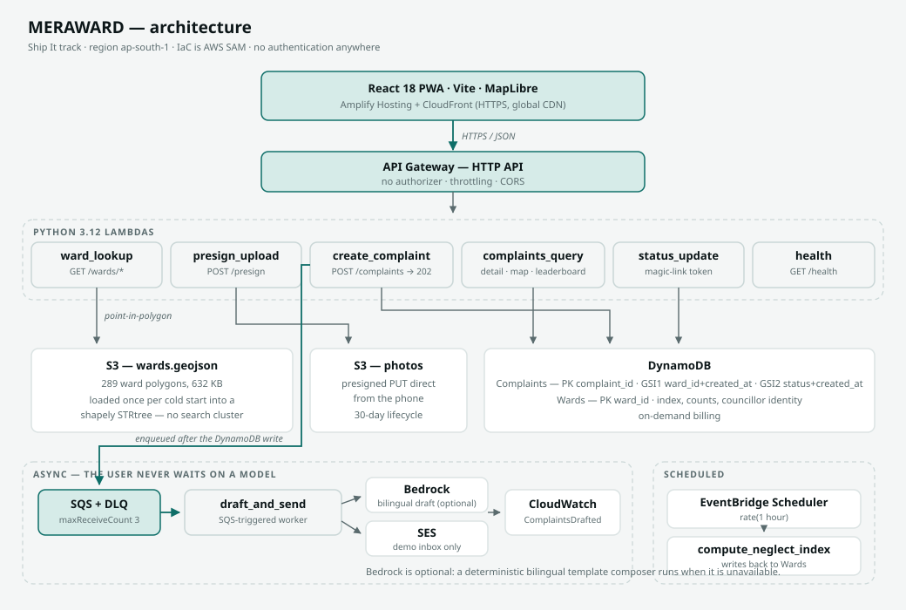
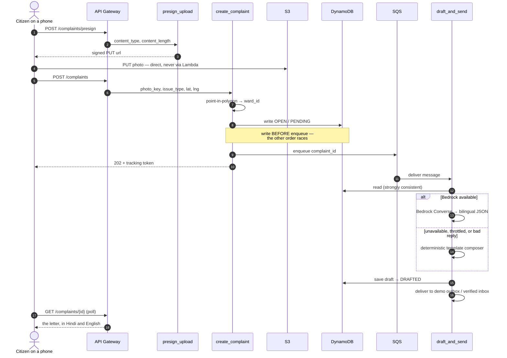
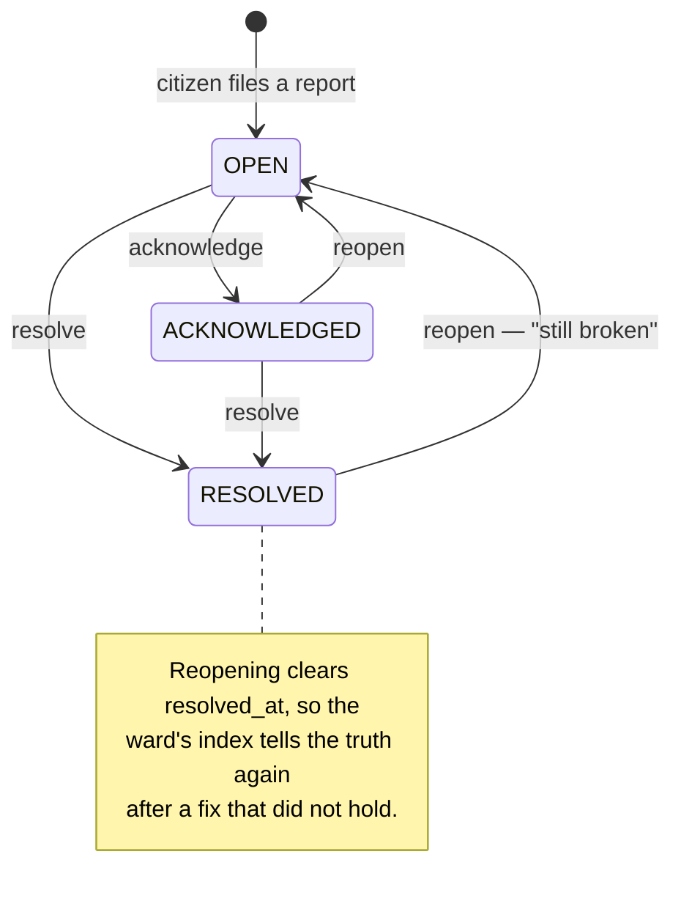

<div align="center">

# MERAWARD

### Know your ward. Route your complaint. See who's ignoring you.

Civic accountability for Delhi's municipal wards — find the ward you're standing in,
file a photo-backed complaint that drafts itself into a formal letter in Hindi **and**
English, and see a public scoreboard of which wards are being ignored.

[](backend/tests)
[](#performance)
[](backend/)
[](frontend/)
[](backend/README.md)
[](LICENSE)

**First Commit · Bharat Builds Tour** (WeMakeDevs × AWS Builder Center) · **Ship It** track

</div>

---

## Contents

| | |
|---|---|
| [The problem](#the-problem) · [The solution](#the-solution) | why this exists |
| [Architecture](#architecture) · [Request flow](#request-flow) | how it works |
| [Repository layout](#repository-layout) · [Local setup](#local-setup) | how to run it |
| [Performance](#performance) · [Status](#status) | what state it's in |
| [Data & demo-mode disclaimer](#data--demo-mode-disclaimer) | **read this before judging the data** |
| [AI tools used](#ai-tools-used) | required disclosure |

Deeper reading: [`docs/DECISIONS.md`](docs/DECISIONS.md) (why things are the way they are) ·
[`docs/SUBMISSION.md`](docs/SUBMISSION.md) (the writeup) ·
[`docs/AWS_SETUP.md`](docs/AWS_SETUP.md) (deployment runbook) ·
[`CREDITS.md`](CREDITS.md) (data provenance) ·
[`LEARNING.md`](LEARNING.md) · [`KNOWN_ISSUES.md`](KNOWN_ISSUES.md)

---

## The problem

Delhi has hundreds of municipal wards. Each has an elected councillor whose remit
covers exactly the things that stay broken: potholes, streetlights, garbage, drains,
waterlogging.

| | |
|---|---|
| **Nobody knows their ward** | Boundaries were redrawn in 2022 and most people still cite the old zones. There is no simple "which ward am I in?" tool. |
| **Complaints go into black holes** | Portals accept a complaint and offer no tracking, no escalation, no consequence. People tweet into the void instead. |
| **There is no public scoreboard** | No ward-level data on open complaints or resolution speed exists publicly, so "which areas get ignored" stays a rumour instead of a number. |

The same pothole survives three monsoons, and holding anyone to account requires
knowing who to ask — which almost nobody does.

## The solution

1. **Which ward am I in?** — GPS or a dropped pin returns your ward, its zone, its
   councillor where we could source one, and its **Ward Neglect Index**.
2. **One-tap report** — photo + issue type → a formal complaint drafted **in Hindi and
   English**, routed to the correct ward office, tracked publicly. **No signup.**
3. **Public accountability dashboard** — complaint heatmap across Delhi, plus wards
   ranked by Neglect Index.

---

## Architecture



**AWS services:** Lambda · API Gateway · DynamoDB · S3 · SQS (+DLQ) · Bedrock · SES ·
EventBridge Scheduler · CloudWatch · Amplify Hosting / CloudFront. **IaC is AWS SAM.**

Three decisions worth knowing up front:

- **Point-in-polygon runs inside the Lambda.** 289 ward polygons load from S3 once per
  cold start into a `shapely` STRtree held at module level. Warm lookups measure
  **0.023 ms**. A managed search cluster was considered and rejected — OpenSearch
  Serverless has a 2-OCU floor of roughly $11/day, which would have made our own cost
  claim false.
- **SQS sits between the API and the AI draft.** The API returns `202` in ~2 ms and the
  user never waits on a model.
- **Bedrock is optional by design.** A deterministic bilingual template composer was
  written *first* and returns the same shape, so the model is a config flag rather than
  a dependency.

### Request flow



### Complaint lifecycle



Every transition is authorised by a magic-link token compared in constant time, and
every write is conditional on the current status, so two people clicking the same link
cannot both win.

---

## Repository layout

```
backend/     Python 3.12 Lambdas + AWS SAM      245 tests, no AWS needed to run them
  src/common/    shared: geometry, index, store, validation, drafting, delivery
  src/<fn>/      one package per Lambda — handler path is <fn>.app.handler
frontend/    React 18 + Vite + TS + Tailwind + MapLibre, as a PWA
data/        ward polygon pipeline + the committed wards.geojson
docs/        architecture, decisions log, deployment runbook, submission writeup
```

## Local setup

### Backend

```bash
python -m pip install -r backend/requirements-dev.txt
python -m pytest backend -q          # 245 tests, no AWS credentials needed
```

`WARDS_GEOJSON_PATH` points the ward index at a local GeoJSON file instead of S3 —
also how `sam local` should be run.

### Frontend

```bash
cd frontend
npm install
cp .env.example .env                 # then set VITE_API_BASE_URL
npm run dev
```

### Ward boundary data

```bash
python data/prepare_wards.py data/raw/<source>.geojson data/wards.geojson
```

Environment variables are documented in [`.env.example`](.env.example) and
[`frontend/.env.example`](frontend/.env.example). Never commit a real `.env`.

---

## Status

| | |
|---|---|
| Live URL | _pending deployment_ |
| Demo video | _pending_ |
| Region | `ap-south-1` (Mumbai) |
| Backend | ✅ complete — 245 tests passing |
| Frontend | ✅ complete — every screen built |
| Ward data | ✅ 289 real polygons committed |
| Deployment | ⏳ blocked on AWS account provisioning |

### Performance

Lighthouse, mobile, simulated throttling, against the production build:

| page | performance | accessibility | best practices | SEO |
|---|:---:|:---:|:---:|:---:|
| `/` | **100** | **100** | **100** | **100** |
| `/about` | 95 | **100** | **100** | **100** |
| `/dashboard` | 86 | **100** | **100** | **100** |
| `/ward` | 80 | **100** | **100** | **100** |

`/ward` and `/dashboard` score lower on performance because they load MapLibre. That is
the floor for a map page, not a defect — MapLibre is split into its own chunk that `/`
and `/about` never fetch, and it is excluded from service-worker precaching so a visitor
who only reads `/about` never pays 800 kB for it.

---

## Data & demo-mode disclaimer

> **Complaint data on the deployed demo is generated for demonstration.**
> Every seeded record carries `is_demo = true` and the UI says so on screen.
> Reports filed through the site are real and are not flagged.

- **The Ward Neglect Index scores a ward, never a person.** It is computed partly from
  generated data; attaching such a number to a real, named, elected individual would be
  indefensible. Councillor details, where shown, are identity only and visually separated.
- **A ward with fewer than five reports has no index at all** — not zero. Scoring a
  silent ward as zero would rank the wards nobody reports as the best-run in the city.
- **Councillor fields we could not source render as an explicit "not available".**
  We never invent councillor data.
- **We do not email real officials.** Complaints go to a demo outbox and a verified demo
  inbox. The live-send path exists in code and is refused at runtime.
- **Our ward boundaries are real but not current** — the pre-2022 delimitation. See
  [`CREDITS.md`](CREDITS.md) for why, and the deployed `/about` page states it plainly.

---

## AI tools used

AI coding tools are permitted under the hackathon rules **if disclosed**. We used them
heavily, and this is the disclosure.

| Tool | Used for |
|---|---|
| **Claude** (Anthropic), via Claude Code | PRD review and rewrite, architecture critique, backend Lambdas, frontend screens, test authoring, ward-data pipeline, performance work, documentation |
| **Amazon Bedrock** | A **runtime product feature**, not a build tool — it drafts the bilingual complaint letter |

Every architectural decision, scope cut and service choice was reviewed and accepted by
the team. Commit history is unmodified: no force-pushes, no squashes, no rewritten commit
dates, and all three members commit under their own accounts.

---

## Team — Sleepy peeps (`4T5AKB`)

| | Role |
|---|---|
| **Amrit Kang** ([@amritkang165](https://github.com/amritkang165)) | Team lead · frontend · ward data · submission |
| **Kartik Dixit** ([@Kartikdixit2468](https://github.com/Kartikdixit2468)) | AWS infrastructure · SAM · delivery pipeline |
| **Muneer Alam** ([@Muneer320](https://github.com/Muneer320)) | Backend Lambdas · geospatial · index |

## Licence

[MIT](LICENSE). Ward boundary data is © DataMeet contributors under
[CC BY-SA 2.5 IN](http://creativecommons.org/licenses/by-sa/2.5/in/) — see
[`CREDITS.md`](CREDITS.md).
